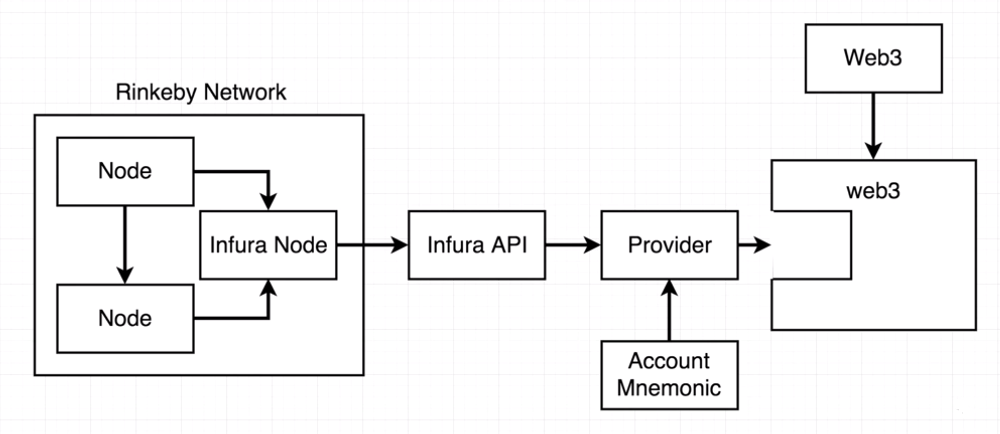

# Custom Node Design

***This repository contains the code that is aimed at solving the issues as shown in the table below. We'll be creating a custom javascript project that will be able to compile the Solidity contracts, deploy them on a test network and interact with that without using Remix or any other IDE. The project also includes the scripts to automatically test the Solidity contract and validate them instead of putting the values one by one on Remix to test the contract out.***


## Project Directory Layout Description


**1. Contracts Directory:** Contains all the Solidity Contract code files ex. Inbox.sol.

**2. test:** Contains the Javascript files to automatically test the Solidity Contract instead of testing it using Remix.

**3. package.json:** Scripts for packages

**4. compile.js:**  Looks into the Contracts directory and compile each of the Solidity contracts available

**5. deploy.js:** Script file to take some compiled code and run it on Blockchain network.

# Requirements

**1. Install Solidity Compiler using the following command:**

```
npm install --save solc
```

**2. Ganache [Local Etherium Test Network], Mocha [https://mochajs.org/] and Web3 [Library to access the bytecode on a blockchain network programatically] Installation:**

```
npm install --save mocha ganache-cli web3@1.0.0-beta.26
```

**3. Wallet Provider**

```
npm install --save truffle-hdwallet-provider
```

# Test Plan


**a.** We'll be using the Solidity compiler to compile the Solidity contract and get the Bytecode and the ABI from that.

**b.** Then we deploy our Bytecode on a "Local Test Network" using "Ganache/TestRPC".

**c.** On other side, take the ABI and feed it into "Web3 library" which is a library that we use to get access to a deployed contract programatically on a Network.


# Usage: 

**1. Run the "compile.js" file as:**

```
node compile.js
```

**Logging the Solidity Contract "Inbox.sol" Compilation returns the following:**

```
{ contracts:
   { ':Inbox':
      { assembly: [Object],
        bytecode: '608060405234801561001057600080fd5b5060405161038c38038061038c83398101604052805101805161003a906000906020840190610041565b50506100dc565b828054600181600116156101000203166002900490600052602060002090601f016020900481019282601f1061008257805160ff19168380011785556100af565b828001600101855582156100af579182015b828111156100af578251825591602001919060010190610094565b506100bb9291506100bf565b5090565b6100d991905b808211156100bb57600081556001016100c5565b90565b6102a1806100eb6000396000f30060806040526004361061004b5763ffffffff7c0100000000000000000000000000000000000000000000000000000000600035041663368b87728114610050578063e21f37ce146100ab575b600080fd5b34801561005c57600080fd5b506040805160206004803580820135601f81018490048402850184019095528484526100a99436949293602493928401919081908401838280828437509497506101359650505050505050565b005b3480156100b757600080fd5b506100c061014c565b6040805160208082528351818301528351919283929083019185019080838360005b838110156100fa5781810151838201526020016100e2565b50505050905090810190601f1680156101275780820380516001836020036101000a031916815260200191505b509250505060405180910390f35b80516101489060009060208401906101da565b5050565b6000805460408051602060026001851615610100026000190190941693909304601f810184900484028201840190925281815292918301828280156101d25780601f106101a7576101008083540402835291602001916101d2565b820191906000526020600020905b8154815290600101906020018083116101b557829003601f168201915b505050505081565b828054600181600116156101000203166002900490600052602060002090601f016020900481019282601f1061021b57805160ff1916838001178555610248565b82800160010185558215610248579182015b8281111561024857825182559160200191906001019061022d565b50610254929150610258565b5090565b61027291905b80821115610254576000815560010161025e565b905600a165627a7a723058208226965275eb321d959f7dbead6988a508e8627b759b19ba64f89e4d0e6432620029',
        functionHashes: [Object],
        gasEstimates: [Object],
        interface: '[{"constant":false,"inputs":[{"name":"newMessage","type":"string"}],"name":"setMessage","outputs":[],"payable":false,"stateMutability":"nonpayable","type":"function"},{"constant":true,"inputs":[],"name":"message","outputs":[{"name":"","type":"string"}],"payable":false,"stateMutability":"view","type":"function"},{"inputs":[{"name":"initialMessage","type":"string"}],"payable":false,"stateMutability":"nonpayable","type":"constructor"}]',
        metadata: '{"compiler":{"version":"0.4.24+commit.e67f0147"},"language":"Solidity","output":{"abi":[{"constant":false,"inputs":[{"name":"newMessage","type":"string"}],"name":"setMessage","outputs":[],"payable":false,"stateMutability":"nonpayable","type":"function"},{"constant":true,"inputs":[],"name":"message","outputs":[{"name":"","type":"string"}],"payable":false,"stateMutability":"view","type":"function"},{"inputs":[{"name":"initialMessage","type":"string"}],"payable":false,"stateMutability":"nonpayable","type":"constructor"}],"devdoc":{"methods":{}},"userdoc":{"methods":{}}},"settings":{"compilationTarget":{"":"Inbox"},"evmVersion":"byzantium","libraries":{},"optimizer":{"enabled":true,"runs":200},"remappings":[]},"sources":{"":{"keccak256":"0xf90397613c3b95af8e1f91bc6be8465ddf6443ea6e9059db8048d9ff01cb6c65","urls":["bzzr://b9d8729f045779364d503e46ced7132e48873517a46c9073c0db7f500f4aab7a"]}},"version":1}',
        opcodes: 'PUSH1 0x80 PUSH1 0x40 MSTORE CALLVALUE DUP1 ISZERO PUSH2 0x10 JUMPI PUSH1 0x0 DUP1 REVERT JUMPDEST POP PUSH1 0x40 MLOAD PUSH2 0x38C CODESIZE SUB DUP1 PUSH2 0x38C DUP4 CODECOPY DUP2 ADD PUSH1 0x40 MSTORE DUP1 MLOAD ADD DUP1 MLOAD PUSH2 0x3A SWAP1 PUSH1 0x0 SWAP1 PUSH1 0x20 DUP5 ADD SWAP1 PUSH2 0x41 JUMP JUMPDEST POP POP PUSH2 0xDC JUMP JUMPDEST DUP3 DUP1 SLOAD PUSH1 0x1 DUP2 PUSH1 0x1 AND ISZERO PUSH2 0x100 MUL SUB AND PUSH1 0x2 SWAP1 DIV SWAP1 PUSH1 0x0 MSTORE PUSH1 0x20 PUSH1 0x0 KECCAK256 SWAP1 PUSH1 0x1F ADD PUSH1 0x20 SWAP1 DIV DUP2 ADD SWAP3 DUP3 PUSH1 0x1F LT PUSH2 0x82 JUMPI DUP1 MLOAD PUSH1 0xFF NOT AND DUP4 DUP1 ADD OR DUP6 SSTORE PUSH2 0xAF JUMP JUMPDEST DUP3 DUP1 ADD PUSH1 0x1 ADD DUP6 SSTORE DUP3 ISZERO PUSH2 0xAF JUMPI SWAP2 DUP3 ADD JUMPDEST DUP3 DUP2 GT ISZERO PUSH2 0xAF JUMPI DUP3 MLOAD DUP3 SSTORE SWAP2 PUSH1 0x20 ADD SWAP2 SWAP1 PUSH1 0x1 ADD SWAP1 PUSH2 0x94 JUMP JUMPDEST POP PUSH2 0xBB SWAP3 SWAP2 POP PUSH2 0xBF JUMP JUMPDEST POP SWAP1 JUMP JUMPDEST PUSH2 0xD9 SWAP2 SWAP1 JUMPDEST DUP1 DUP3 GT ISZERO PUSH2 0xBB JUMPI PUSH1 0x0 DUP2 SSTORE PUSH1 0x1 ADD PUSH2 0xC5 JUMP JUMPDEST SWAP1 JUMP JUMPDEST PUSH2 0x2A1 DUP1 PUSH2 0xEB PUSH1 0x0 CODECOPY PUSH1 0x0 RETURN STOP PUSH1 0x80 PUSH1 0x40 MSTORE PUSH1 0x4 CALLDATASIZE LT PUSH2 0x4B JUMPI PUSH4 0xFFFFFFFF PUSH29 0x100000000000000000000000000000000000000000000000000000000 PUSH1 0x0 CALLDATALOAD DIV AND PUSH4 0x368B8772 DUP2 EQ PUSH2 0x50 JUMPI DUP1 PUSH4 0xE21F37CE EQ PUSH2 0xAB JUMPI JUMPDEST PUSH1 0x0 DUP1 REVERT JUMPDEST CALLVALUE DUP1 ISZERO PUSH2 0x5C JUMPI PUSH1 0x0 DUP1 REVERT JUMPDEST POP PUSH1 0x40 DUP1 MLOAD PUSH1 0x20 PUSH1 0x4 DUP1 CALLDATALOAD DUP1 DUP3 ADD CALLDATALOAD PUSH1 0x1F DUP2 ADD DUP5 SWAP1 DIV DUP5 MUL DUP6 ADD DUP5 ADD SWAP1 SWAP6 MSTORE DUP5 DUP5 MSTORE PUSH2 0xA9 SWAP5 CALLDATASIZE SWAP5 SWAP3 SWAP4 PUSH1 0x24 SWAP4 SWAP3 DUP5 ADD SWAP2 SWAP1 DUP2 SWAP1 DUP5 ADD DUP4 DUP3 DUP1 DUP3 DUP5 CALLDATACOPY POP SWAP5 SWAP8 POP PUSH2 0x135 SWAP7 POP POP POP POP POP POP POP JUMP JUMPDEST STOP JUMPDEST CALLVALUE DUP1 ISZERO PUSH2 0xB7 JUMPI PUSH1 0x0 DUP1 REVERT JUMPDEST POP PUSH2 0xC0 PUSH2 0x14C JUMP JUMPDEST PUSH1 0x40 DUP1 MLOAD PUSH1 0x20 DUP1 DUP3 MSTORE DUP4 MLOAD DUP2 DUP4 ADD MSTORE DUP4 MLOAD SWAP2 SWAP3 DUP4 SWAP3 SWAP1 DUP4 ADD SWAP2 DUP6 ADD SWAP1 DUP1 DUP4 DUP4 PUSH1 0x0 JUMPDEST DUP4 DUP2 LT ISZERO PUSH2 0xFA JUMPI DUP2 DUP2 ADD MLOAD DUP4 DUP3 ADD MSTORE PUSH1 0x20 ADD PUSH2 0xE2 JUMP JUMPDEST POP POP POP POP SWAP1 POP SWAP1 DUP2 ADD SWAP1 PUSH1 0x1F AND DUP1 ISZERO PUSH2 0x127 JUMPI DUP1 DUP3 SUB DUP1 MLOAD PUSH1 0x1 DUP4 PUSH1 0x20 SUB PUSH2 0x100 EXP SUB NOT AND DUP2 MSTORE PUSH1 0x20 ADD SWAP2 POP JUMPDEST POP SWAP3 POP POP POP PUSH1 0x40 MLOAD DUP1 SWAP2 SUB SWAP1 RETURN JUMPDEST DUP1 MLOAD PUSH2 0x148 SWAP1 PUSH1 0x0 SWAP1 PUSH1 0x20 DUP5 ADD SWAP1 PUSH2 0x1DA JUMP JUMPDEST POP POP JUMP JUMPDEST PUSH1 0x0 DUP1 SLOAD PUSH1 0x40 DUP1 MLOAD PUSH1 0x20 PUSH1 0x2 PUSH1 0x1 DUP6 AND ISZERO PUSH2 0x100 MUL PUSH1 0x0 NOT ADD SWAP1 SWAP5 AND SWAP4 SWAP1 SWAP4 DIV PUSH1 0x1F DUP2 ADD DUP5 SWAP1 DIV DUP5 MUL DUP3 ADD DUP5 ADD SWAP1 SWAP3 MSTORE DUP2 DUP2 MSTORE SWAP3 SWAP2 DUP4 ADD DUP3 DUP3 DUP1 ISZERO PUSH2 0x1D2 JUMPI DUP1 PUSH1 0x1F LT PUSH2 0x1A7 JUMPI PUSH2 0x100 DUP1 DUP4 SLOAD DIV MUL DUP4 MSTORE SWAP2 PUSH1 0x20 ADD SWAP2 PUSH2 0x1D2 JUMP JUMPDEST DUP3 ADD SWAP2 SWAP1 PUSH1 0x0 MSTORE PUSH1 0x20 PUSH1 0x0 KECCAK256 SWAP1 JUMPDEST DUP2 SLOAD DUP2 MSTORE SWAP1 PUSH1 0x1 ADD SWAP1 PUSH1 0x20 ADD DUP1 DUP4 GT PUSH2 0x1B5 JUMPI DUP3 SWAP1 SUB PUSH1 0x1F AND DUP3 ADD SWAP2 JUMPDEST POP POP POP POP POP DUP2 JUMP JUMPDEST DUP3 DUP1 SLOAD PUSH1 0x1 DUP2 PUSH1 0x1 AND ISZERO PUSH2 0x100 MUL SUB AND PUSH1 0x2 SWAP1 DIV SWAP1 PUSH1 0x0 MSTORE PUSH1 0x20 PUSH1 0x0 KECCAK256 SWAP1 PUSH1 0x1F ADD PUSH1 0x20 SWAP1 DIV DUP2 ADD SWAP3 DUP3 PUSH1 0x1F LT PUSH2 0x21B JUMPI DUP1 MLOAD PUSH1 0xFF NOT AND DUP4 DUP1 ADD OR DUP6 SSTORE PUSH2 0x248 JUMP JUMPDEST DUP3 DUP1 ADD PUSH1 0x1 ADD DUP6 SSTORE DUP3 ISZERO PUSH2 0x248 JUMPI SWAP2 DUP3 ADD JUMPDEST DUP3 DUP2 GT ISZERO PUSH2 0x248 JUMPI DUP3 MLOAD DUP3 SSTORE SWAP2 PUSH1 0x20 ADD SWAP2 SWAP1 PUSH1 0x1 ADD SWAP1 PUSH2 0x22D JUMP JUMPDEST POP PUSH2 0x254 SWAP3 SWAP2 POP PUSH2 0x258 JUMP JUMPDEST POP SWAP1 JUMP JUMPDEST PUSH2 0x272 SWAP2 SWAP1 JUMPDEST DUP1 DUP3 GT ISZERO PUSH2 0x254 JUMPI PUSH1 0x0 DUP2 SSTORE PUSH1 0x1 ADD PUSH2 0x25E JUMP JUMPDEST SWAP1 JUMP STOP LOG1 PUSH6 0x627A7A723058 KECCAK256 DUP3 0x26 SWAP7 MSTORE PUSH22 0xEB321D959F7DBEAD6988A508E8627B759B19BA64F89E 0x4d 0xe PUSH5 0x3262002900 ',
        runtimeBytecode: '60806040526004361061004b5763ffffffff7c0100000000000000000000000000000000000000000000000000000000600035041663368b87728114610050578063e21f37ce146100ab575b600080fd5b34801561005c57600080fd5b506040805160206004803580820135601f81018490048402850184019095528484526100a99436949293602493928401919081908401838280828437509497506101359650505050505050565b005b3480156100b757600080fd5b506100c061014c565b6040805160208082528351818301528351919283929083019185019080838360005b838110156100fa5781810151838201526020016100e2565b50505050905090810190601f1680156101275780820380516001836020036101000a031916815260200191505b509250505060405180910390f35b80516101489060009060208401906101da565b5050565b6000805460408051602060026001851615610100026000190190941693909304601f810184900484028201840190925281815292918301828280156101d25780601f106101a7576101008083540402835291602001916101d2565b820191906000526020600020905b8154815290600101906020018083116101b557829003601f168201915b505050505081565b828054600181600116156101000203166002900490600052602060002090601f016020900481019282601f1061021b57805160ff1916838001178555610248565b82800160010185558215610248579182015b8281111561024857825182559160200191906001019061022d565b50610254929150610258565b5090565b61027291905b80821115610254576000815560010161025e565b905600a165627a7a723058208226965275eb321d959f7dbead6988a508e8627b759b19ba64f89e4d0e6432620029',
        srcmap: '224:934:0:-;;;866:88;8:9:-1;5:2;;;30:1;27;20:12;5:2;866:88:0;;;;;;;;;;;;;;;;;922:24;;;;:7;;:24;;;;;:::i;:::-;;866:88;224:934;;;;;;;;;;;;;;;;;;;;;;;;;;;;;;;;;;;;;;;;;;;;;;;;;;;;;;;;;;;;;;;;;;;;;;;;;;;;;;;;;;;;;;;;-1:-1:-1;224:934:0;;;-1:-1:-1;224:934:0;:::i;:::-;;;:::o;:::-;;;;;;;;;;;;;;;;;;;;:::o;:::-;;;;;;;',
        srcmapRuntime: '224:934:0:-;;;;;;;;;;;;;;;;;;;;;;;;;;;;1068:85;;8:9:-1;5:2;;;30:1;27;20:12;5:2;-1:-1;1068:85:0;;;;;;;;;;;;;;;;;;;;;;;;;;;;;;;;;;;;;;;;;;;;;;;;;;;;-1:-1:-1;1068:85:0;;-1:-1:-1;1068:85:0;;-1:-1:-1;;;;;;;1068:85:0;;;725:21;;8:9:-1;5:2;;;30:1;27;20:12;5:2;725:21:0;;;;;;;;;;;;;;;;;;;;;;;;;;;;;;;;;;;8:100:-1;33:3;30:1;27:10;8:100;;;90:11;;;84:18;71:11;;;64:39;52:2;45:10;8:100;;;12:14;725:21:0;;;;;;;;;;;;;;;;;;;;;;;;;;;;;;;;;;;;;;;;;;;;;;;;1068:85;1125:20;;;;:7;;:20;;;;;:::i;:::-;;1068:85;:::o;725:21::-;;;;;;;;;;;;;;;-1:-1:-1;;725:21:0;;;;;;;;;;;;;;;;;;;;;;;;;;;;;;;;;;;;;;;;;;;;;;;;;;;;;;;;;;;;;;;;;;;;;;;;;;;;;;;;;;;;;;;;;;;;;;;;;:::o;224:934::-;;;;;;;;;;;;;;;;;;;;;;;;;;;;;;;;;;;;;;;;;;;;;;;;;;;;;;;;;;;;;;;;;;;;;;;;;;;;;;;;;;;;;;-1:-1:-1;224:934:0;;;-1:-1:-1;224:934:0;:::i;:::-;;;:::o;:::-;;;;;;;;;;;;;;;;;;;;:::o' } },
  errors:
   [ ':20:5: Warning: Defining constructors as functions with the same name as the contract is deprecated. Use "constructor(...) { ... }" instead.\n    function Inbox(string initialMessage) public {\r\n    ^ (Relevant source part starts here and spans across multiple lines).\n' ],
  sourceList: [ '' ],
  sources: { '': { AST: [Object] } } }
```

***Here, it shows the contracts folder and the solidity contracts that it has compiled. In our case that contract is "Inbox.sol".
The compilation returns a "bytecode" that will be deployed onto the blockchain and "interface" for Javascript which is our "ABI layer".***


**2. Run the "Inbox.test.js" file as:**

```
node run test
```

This compiles the Solidity Contract and runs a test for it using MOCHA framework. The output for this is as follows:

```
Inbox
(node:30444) MaxListenersExceededWarning: Possible EventEmitter memory leak detected. 11 data listeners added. Use emitter.setMaxListeners() to increase limit
[ '0x74C1d64EF0Ce7b870842e9b9da7fa2aed16c0F62',
  '0x07b4F1Eb15D2cd8f0115413b9E2Aa4A750B10aC0',
  '0xb49F8EeaD4Bd60d98c4e823127922D114f660660',
  '0x56259CAd6F08e5B06C57791c44C9ef15Ef4379E8',
  '0x9D8A1462aDa7D9e12Fb668D678D1D75091e3FfF1',
  '0x3E0C1fbF8a66e533aBf8f33063B62634f19E6888',
  '0x9aaD2bfcf5277262D25FADC3326F3E93e4871199',
  '0xdcd72CF5ad2A42F9A7ca53Ad7052bbb6277D9d3C',
  '0x1B9Da1c44E17cFD24f837634aCB643858F9D7D2C',
  '0x0E9824Bd384dcE6bDc5D91A7c3b89E45155508B1' ]
Contract {
  currentProvider: [Getter/Setter],
  _requestManager:
   RequestManager {
     provider:
      l {
        domain: null,
        _events: [Object],
        _eventsCount: 1,
        _maxListeners: undefined,
        options: [Object],
        engine: [Object],
        manager: [Object],
        sendAsync: [Function: bound ],
        send: [Function: bound ],
        close: [Function: bound ],
        _queueRequest: [Function: bound ],
        _processRequestQueue: [Function: bound ],
        _requestQueue: [],
        _requestInProgress: false },
     providers:
      { WebsocketProvider: [Function: WebsocketProvider],
        HttpProvider: [Function: HttpProvider],
        IpcProvider: [Function: IpcProvider] },
     subscriptions: {} },
  givenProvider: null,
  providers:
   { WebsocketProvider: [Function: WebsocketProvider],
     HttpProvider: [Function: HttpProvider],
     IpcProvider: [Function: IpcProvider] },
  _provider:
   l {
     domain: null,
     _events: { data: [Array] },
     _eventsCount: 1,
     _maxListeners: undefined,
     options:
      { vmErrorsOnRPCResponse: true,
        verbose: false,
        asyncRequestProcessing: false,
        logger: [Object],
        seed: 'CIglZSHWpW',
        mnemonic: 'host citizen jaguar pluck hotel flee vote vendor foam fossil miracle split',
        network_id: 1533318192566,
        total_accounts: 10,
        gasPrice: '0x4A817C800',
        default_balance_ether: 100,
        unlocked_accounts: [],
        hdPath: 'm/44\'/60\'/0\'/0/',
        gasLimit: '0x6691b7',
        defaultTransactionGasLimit: '0x15f90',
        time: null,
        debug: false,
        allowUnlimitedContractSize: false },
     engine:
      s {
        domain: null,
        _events: [Object],
        _eventsCount: 1,
        _maxListeners: 100,
        _blockTracker: [Object],
        _ready: [Object],
        currentBlock: [Object],
        _providers: [Array],
        manager: [Object] },
     manager:
      s {
        state: [Object],
        options: [Object],
        initialized: true,
        initialization_error: null,
        post_initialization_callbacks: [],
        engine: [Object],
        currentBlock: [Object] },
     sendAsync: [Function: bound ],
     send: [Function: bound ],
     close: [Function: bound ],
     _queueRequest: [Function: bound ],
     _processRequestQueue: [Function: bound ],
     _requestQueue: [],
     _requestInProgress: false },
  setProvider: [Function],
  BatchRequest: [Function: bound Batch],
  extend:
   { [Function: ex]
     formatters:
      { inputDefaultBlockNumberFormatter: [Function: inputDefaultBlockNumberFormatter],
        inputBlockNumberFormatter: [Function: inputBlockNumberFormatter],
        inputCallFormatter: [Function: inputCallFormatter],
        inputTransactionFormatter: [Function: inputTransactionFormatter],
        inputAddressFormatter: [Function: inputAddressFormatter],
        inputPostFormatter: [Function: inputPostFormatter],
        inputLogFormatter: [Function: inputLogFormatter],
        inputSignFormatter: [Function: inputSignFormatter],
        outputBigNumberFormatter: [Function: outputBigNumberFormatter],
        outputTransactionFormatter: [Function: outputTransactionFormatter],
        outputTransactionReceiptFormatter: [Function: outputTransactionReceiptFormatter],
        outputBlockFormatter: [Function: outputBlockFormatter],
        outputLogFormatter: [Function: outputLogFormatter],
        outputPostFormatter: [Function: outputPostFormatter],
        outputSyncingFormatter: [Function: outputSyncingFormatter] },
     utils:
      { _fireError: [Function: _fireError],
        _jsonInterfaceMethodToString: [Function: _jsonInterfaceMethodToString],
        randomHex: [Function: randomHex],
        _: [Object],
        BN: [Object],
        isBN: [Function: isBN],
        isBigNumber: [Function: isBigNumber],
        isHex: [Function: isHex],
        isHexStrict: [Function: isHexStrict],
        sha3: [Object],
        keccak256: [Object],
        soliditySha3: [Function: soliditySha3],
        isAddress: [Function: isAddress],
        checkAddressChecksum: [Function: checkAddressChecksum],
        toChecksumAddress: [Function: toChecksumAddress],
        toHex: [Function: toHex],
        toBN: [Function: toBN],
        bytesToHex: [Function: bytesToHex],
        hexToBytes: [Function: hexToBytes],
        hexToNumberString: [Function: hexToNumberString],
        hexToNumber: [Function: hexToNumber],
        toDecimal: [Function: hexToNumber],
        numberToHex: [Function: numberToHex],
        fromDecimal: [Function: numberToHex],
        hexToUtf8: [Function: hexToUtf8],
        hexToString: [Function: hexToUtf8],
        toUtf8: [Function: hexToUtf8],
        utf8ToHex: [Function: utf8ToHex],
        stringToHex: [Function: utf8ToHex],
        fromUtf8: [Function: utf8ToHex],
        hexToAscii: [Function: hexToAscii],
        toAscii: [Function: hexToAscii],
        asciiToHex: [Function: asciiToHex],
        fromAscii: [Function: asciiToHex],
        unitMap: [Object],
        toWei: [Function: toWei],
        fromWei: [Function: fromWei],
        padLeft: [Function: leftPad],
        leftPad: [Function: leftPad],
        padRight: [Function: rightPad],
        rightPad: [Function: rightPad],
        toTwosComplement: [Function: toTwosComplement] },
     Method: [Function: Method] },
  clearSubscriptions: [Function],
  options:
   { address: [Getter/Setter],
     jsonInterface: [Getter/Setter],
     data: undefined,
     from: undefined,
     gasPrice: undefined,
     gas: undefined },
  defaultAccount: [Getter/Setter],
  defaultBlock: [Getter/Setter],
  methods:
   { setMessage: [Function: bound _createTxObject],
     '0x368b8772': [Function: bound _createTxObject],
     'setMessage(string)': [Function: bound _createTxObject],
     message: [Function: bound _createTxObject],
     '0xe21f37ce': [Function: bound _createTxObject],
     'message()': [Function: bound _createTxObject] },
  events: { allEvents: [Function: bound ] },
  _address: '0xA9D4d17704bE9F8734a078eC582458A0A5A0e374',
  _jsonInterface:
   [ { constant: false,
       inputs: [Array],
       name: 'setMessage',
       outputs: [],
       payable: false,
       stateMutability: 'nonpayable',
       type: 'function',
       signature: '0x368b8772' },
     { constant: true,
       inputs: [],
       name: 'message',
       outputs: [Array],
       payable: false,
       stateMutability: 'view',
       type: 'function',
       signature: '0xe21f37ce' },
     { inputs: [Array],
       payable: false,
       stateMutability: 'nonpayable',
       type: 'constructor',
       constant: undefined,
       signature: 'constructor' } ] }
    v deploys a contract


  1 passing (312ms)
```

## MOCHA Framework working Structure


**1.** Start -> bootup -> Inbox.test.js execution automatically

**2.** [beforeEach]  Deploy a new contract to local test network Gnashe

**3.** ["it"]  Manipulate contract, maybe send a new message

**4.** ["it"]  Make an assertion about the contract. (Assertion always in "it" block)

**5.** [Repeat "beforeEach"]  Deploy a new contract and repeat from step-2

***A contract is created through a transaction. Ganache automatically sets up unlocked [No public/private keys required] test accounts to test our contract locally.***

## Deployment of Solidity Contract on Rinkeby Test Network



## Infura API

To deploy this test script and contract to a Rinkeby Network, we need some ether. Also, we need access to at-least one node from the Rinkeby network to deploy our contract. To do this, we use "Infura API" that has it's nodes on the Rinkeby network on the backend.

Here, we use a custom provider as compared to the one already provided as in case with Ganache. The provider is unlocked to be used with the Web3 application using the 12 Word Account Mnemonic that is provided by Metamask.

To signup for Infura, go to:

```
infura.io
```

and get your credentials:

```
Infura API Key: xxxxxxxxxxxxxxxxxxxxxxxxxxxxxxxxxxxx
Rinkeby Endpoint: https://rinkeby.infura.io/v3/xxxxxxxxxxxxxxxxxxxxxxxxxxxxxxxxxx
```

# Deploy DAPP on Test Network

**1.** Run the "deploy.js" code using the following command:

```
node deploy.js
```

This file automatically compiles the Solidity Contract code in the file "Inbox.sol" and deploys it using Web3 and HDWalletProvider.

**2.** To test that the contract is online, copy the code from the file "Inbox.sol" and paste into the Remix Editor online.

**3.** Select "Injected Web3" as your environment and your address from "Account". Put in the Gas Limit of 3000000.

**4.** Next, get the address at which your contract is deployed from "deploy.js" execution and paste that into "At Address" field in Remix Editor.

**5.** Click on "message" to view the initial message that we have set in the script.

**6.** Now, enter a new message in front of "setMessage" and click on "set Message". This will start a new transaction on the blockchain, process it and change the message to the new text that you provide.

**7.** To see that how the process goes on behind the scenes, copy the contract deployed address and go to "Etherscan.io". Paste your address on top and click on "Go". Doing this will show you the current state of contract, how it's being processed, the message being processed in bytecode format etc.

**8.** Once the processing ends and "Etherscan" shows "Success" for your contract that means the contract has been processed. Now, go back to Remix Editor and see for the logs. You will see a debug message that tells you the information about whats the status of your deployed contract, how much gas it used, address of who processed it etc.

**9.** Now if you again click on "message" on the right you will see that the text changes to the one you provided in the "set Message" field. That's it. 

**NOTE: Clicking on "message" does not cause any transaction as it is a local process. Executing "set Message" causes a transaction and requires som "Gas" in form of ether to process the request on the network.**
